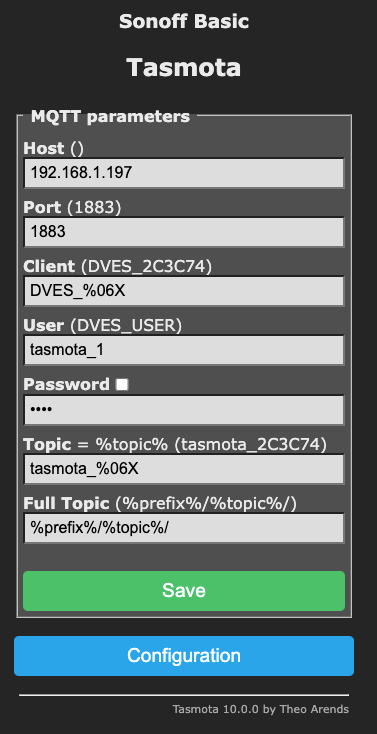
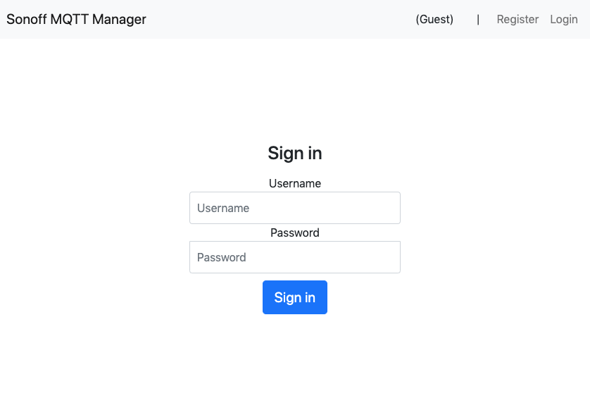
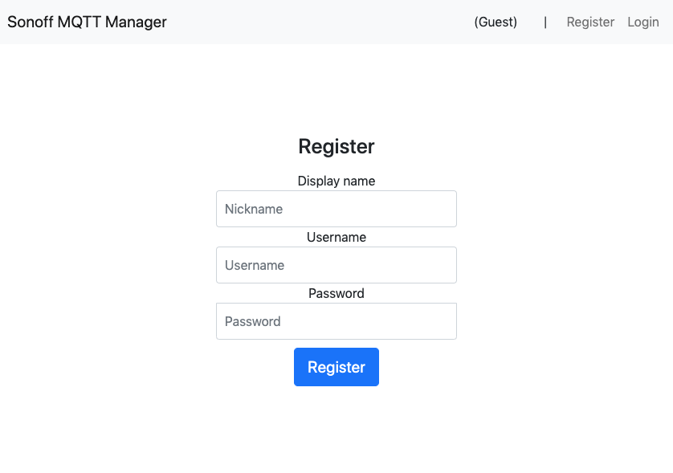
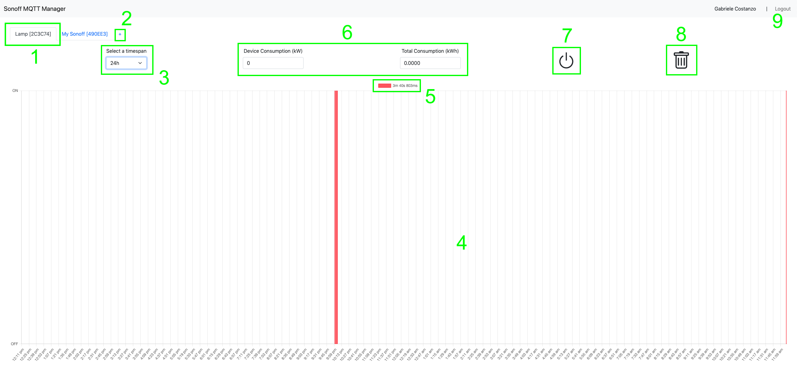
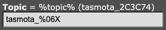
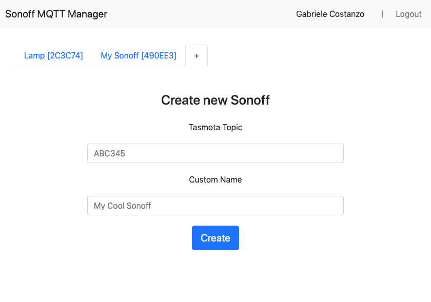

# Sonoff MQTT Manager
<i>( <a href="../../">English</a> | Italiano )</i>
<br/><br/>

Questo progetto è stato utilizzato come elaborato di fine corso in **Internet of Things Based Smart Systems** presso **Unict - Università degli Studi di Catania**.

L'obiettivo principale di questo elaborato consiste nel dimostrare la comprensione da parte dello studente di uno specifico argomento del corso, in questo caso il protocollo MQTT.

---

## In breve

Quest'app fornisce un ambiente full-stack per la gestione dei **Sonoff Wi-Fi Switches**, presupponendo che siano già stati flashati con il **Tasmota** firmware e configurati per connettersi al broker MQTT su rete locale.

Il **backend** fornisce un sistema di autenticazione JWT-based per gli utenti, che permette loro di aggiungere o rimuovere Sonoff alla loro collezione usando gli ID autogenerati da Tasmota.

Sono presenti route API per accendere e spegnere i Sonoff, aggiungerli o eliminarli dalla lista di un utente, o ottenere l'intera collezione.

Ogni volta che un Sonoff cambia di stato, il backend ascolta il suo topic MQTT e crea una nuova Observation nel database, in modo tale da aggiornare di conseguenza ed in tempo reale lo stato sul frontend.

Il **frontend** presenta form per la registrazione ed il login dell'utente al primo avvio, con sessioni di durata massima di 1 ora (valore di default) a seguito della quale si richiede all'utente di effettuare il login.

Una volta loggato, l'utente può navigare fra diverse tab con i Sonoff che possiede, o aggiungerne di nuovi.

Per ogni Sonoff che si seleziona, l'utente può cambiarne lo stato usando un bottone GUI di ON/OFF, eliminarlo dalla sua collezione, e scegliere un intervallo di tempo da considerare (ultima 1 ora, ultime 24 ore, ultimi 7 giorni).

Per un dato intervallo, in **Chart.js** sono graficati a schermo gli eventi di ON e OFF, e viene calcolato il periodo in cui il Sonoff è rimasto acceso, permettendo all'utente di calcolare il consumo energetico atteso inserendo la potenza del dispositivo.

---

## Come riprodurre il mio ambiente locale ed avviare il progetto

Questa repo è stata testata con un'installazione locale del broker MQTT **Eclipse Mosquitto**, ed un'installazione locale di **MongoDB**, entrambi in run sulla stessa macchina che esegue le due app Node.js.

Una volta installati entrambi gli eseguibili, sono stati effettuati i seguenti step per permettere il corretto funzionamento del progetto.

1. ### Configurare una **password list**, una **access list**, e altri parametri per Mosquitto.

    Ad esempio, un utente `node_server` con `password` come sua password, per autenticare l'app di backend, e un utente `tasmota` per autenticare i Sonoff.

    L'eseguibile di default `mosquitto_passwd` è stato utilizzato per creare il file con la password list.
    ```
    # Per creare il file
    mosquitto_passwd -c <password file> <username>

    # Per aggiungere utenti al file
    mosquitto_passwd <password file> <username>

    # Entrambe le istruzioni richiedono poi la password da associare all'utente <username>
    ```

    La access list potrebbe essere necessaria per far sì che il `node_server` sia correttamente "subscribed" ai topic e effettui correttamente "publish".

    Una semplice configurazione per permettere a qualunque utente di accedere tutti i topic in read e write (non è sicuro!) sarebbe:
    ```
    topic readwrite $SYS/#

    pattern readwrite $SYS/#
    ```

    Infine, è richiesto un file `.conf` per comunicare le nuove impostazioni a Mosquitto, modificando il suo config file di default o specificando un nuovo file in fase di esecuzione:
    ```
    mosquitto -c ./mosquitto.conf
    ```

    I parametri da me modificati in configurazione includono:

    ### Definire il password file
    ```
    password_file ./password_file
    ```

    ### Permettere accessi anonimi (non sicuro, opzionale)
    ```
    allow_anonymous true
    ```

    ### Definire la access list
    ```
    acl_file ./acl_file.acl
    ```

    ### Permettere l'accesso sulla rete locale e settare la porta
    ```
    listener 1883 0.0.0.0
    ```

2. ### Configurare Tasmota per usare MQTT correttamente.

    Ogni Sonoff dev'essere configurato sul pannello della web-app accessibile usando l'IP locale del dispositivo, e bisogna assicurare questi settaggi:
    ```
    Host: <l'IP locale del computer che usa Mosquitto>
    Port: 1883
    Client: qualunque
    User: <un username valido nel password file di Mosquitto>
    Password: <password>
    Topic: tasmota_%06X
    Full Topic: %prefix%/%topic%/
    ```

    

    In particolare:
    - il `topic` ed il `full topic` devono essere esattamente tali, poiché il backend si aspetta tale formattazione per i topic
    - l'IP può essere l'IP locale del router se la porta 1883 è stata configurata correttamente per il forwarding
    ```
    192.168.1.1:1883 <-----> 192.168.1.x:1883
    ```

3. ### Creare un database MongoDB per il backend

4. ### Configurare il file `.env`, ad esempio:

    ```
    # MQTT
    HOST=localhost
    PORT=1883
    CLIENT_ID=node_server
    USERNAME=node_server
    PASSWORD=password

    # MONGODB
    DB_HOST=127.0.0.1
    DB_NAME=SonoffDB

    # EXPRESS
    SERVER_HOST=localhost
    SERVER_PORT=3000
    JWT_SECRET=secret
    ```
5. ### Avviare sia Mosquitto che MongoDB, e poi avviare le due app Node.js:

    Backend:

    ```
    cd server
    npm run dev
    ```

    Frontend

    ```
    cd client
    npm run dev
    ```

---

## Come si usa?

Il backend è un'app Express.js attesa in apertura su `localhost:3000` di default, mentre il frontend è un'app Svelte in apertura su `localhost:3001` di default.

Connettendosi su `localhost:3001` per la prima volta dovrebbe causare un redirect alla pagina di **Login**, dalla quale è anche possibile raggiungere la pagina di **Register**.

### Login


### Register


Una volta registrato e loggato un nuovo utente, il `Local Storage` conterrà il `JWT` generato, la sua data di scadenza, e altri parametri, in modo tale da mantenere uno stato client-side dell'app, e l'utente verrà reindirizzato alla **Dashboard**.

### Dashboard


Da qui, l'utente può svolgere una serie di azioni:

1. ### Scegliere una tab per un Sonoff presente in collezione

    Queste tab rappresentano i Sonoff correntemente posseduti dall'utente.
    
    Il nome di ogni tab è costituito dal nome assegnato dall'utente al device, e dal Tasmota ID proprio del device (il placeholder `%06X` nel topic `tasmota_%06X` configurato sulla web app di Tasmota).

    

    In questo esempio, un `Topic` funzionante nella logica dell'app (HTTP + MongoDB) è costituito dalla sola parte finale, `2C3C74`. Sarà compito del backend includere questo topic app-side negli effettivi topic MQTT-side usati per la comunicazione.

    Ad esempio, `stat/tasmota_2C3C74/POWER` è il topic cui bisogna effettuare la subscribe per essere notificati di tutte le modifiche di stato del device, mentre `cmnd/tasmota_2C3C74/Power` è il topic cui bisogna effettuare la publish per triggerare un TOGGLE hardware dello stato del dispositivo.

    Data una tab cliccata ed attiva, gli altri elementi della GUI saranno mappati e sincronizzati in accordo con le Observation registrate per quel dato Sonoff nel database, ad esempio il consumo energetico e il tempo trascorso acceso, lo stato di ON o OFF e il grafico degli eventi.

2. ### Aggiungere un nuovo Sonoff alla collezione

    Cliccando su questa tab si mostra invece un form dal quale è possibile aggiungere un nuovo Sonoff, dati il suo topic Tasmota e un nome custom dato dall'utente.

    

    Se nessun Sonoff esiste con quel topic, il database ne crea uno; altrimenti, l'utente autenticato viene aggiunto alla lista di owners del device, insieme al nome dato.

    Il Sonoff viene quindi aggiunto in una nuova tab. Non è implementato nessun controllo sulla reale esistenza del device: così facendo, si mantiene lo stato dei Sonoff anche quando sono scollegati, o se si connettono via MQTT in un secondo momento, anche mentre l'app è già in esecuzione.

3. ### Scegliere un intervallo temporale

    Sono stati implementati tre intervalli: ultima ora, ultime 24 ore, e ultimi 7 giorni.
    Scegliere un nuovo intervallo aggiorna lo stato dei punti 4, 5 e 6 di conseguenza.

4. ### Il grafico degli eventi

    `Chart.js` è stato utilizzaot per renderizzare un grafico degli eventi di ogni ON e OFF registrato per il Sonoff attivo.

    La logica di backend è quella di registrare come Observation ogni evento legato ad un messaggio MQTT che modifichi l'ultimo stato registrato per il Sonoff, e di cancellare Observations più vecchie di 7 giorni.

    Questo approccio rappresenta un miglioramento rispetto a quelli naive, come ad esempio registrare Observations sulla base di un timer salvando un nuovo oggetto ogni X secondi, poiché non satura il database ed evita di registrare dati inutili che andrebbero comunque eliminati in fase di calcolo dei punti da plottare sul grafico.

    Passare il mouse sopra il grafico ne espone i singoli punti, sui quali un popup mostra l'effettivo stato di ON o OFF registrato, insieme a data ed ora in cui è stata prodotta l'Observation.

5. ### Il tempo trascorso acceso

    L'etichetta del grafico rappresenta il tempo che il device ha trascorso acceso, all'interno dell'intervallo temporale scelto.

6. ### Calcolo del consumo energetico

    Questa semplice calcolatrice richiede all'utente di immettere a sinistra la potenza media del dispositivo, in `kW`, e la moltiplica per il `tempo trascorso acceso` dando in output il consumo energetico medio in `kWh` sulla destra, sempre nell'intervallo di tempo scelto.
    
    Con un semplice update è possibile integrare la potenza del device come campo nel database, tuttavia è sempre meglio lasciare all'utente la possibilità di immettere al volo un valore custom, poiché dispositivi diversi supportano diverse modalità operative, le quali a loro volta corrispondono a diverse quantità di potenza consumata.

7. ### Il Power button ON/OFF

    Questo bottone indica lo stato attuale del device, con una leggera tinta blu in caso di ON, e nessuna tinta attorno ad un bottone grigio in caso di OFF.

    Cliccando il bottone si invia un comando di TOGGLE alla backend API, la quale a sua volta pubblica un comando di TOGGLE su MQTT.

    Lo stato del bottone è sincronizzato grazie ad un meccanismo di subscribe sul topic MQTT del device, e quindi si aggiorna coerentemente ogni volta che lo stato viene modificato per altri mezzi (bottone fisico, publish manuale sul topic, click da web app Tasmota, ...).

8. ### Cancellare il Sonoff

    Questo bottone cancella il Sonoff dalla collezione dell'utente. Sarà effettivamente cancellato dal database se non è rimasto nessun utente che lo possiede, e altrimenti solo l'utente autenticato verrà rimosso dalla lista dei suoi owners.

    le Observations non vengono mai rimosse (eccetto quelle più vecchie di 7 giorni), quindi in caso di cancellazione accidentale lo stato del Sonoff è ripristinato correttamente alla prossima aggiunta, basandosi sulle Observations rimaste.

9. ### Utente corrente e Logout

    Dove prima si trovavano i link di `Login` e `Register`, è ora elencato il nickname dell'utente loggato, insieme ad un link per il `Logout`. Le pagine di Login e Register non sono disponibili finché non avviene il logout, ed in tal caso si svuota anche il Local Storage.

    Un logout automatico è triggerato non appena scade il JWT (di default: in un'ora).