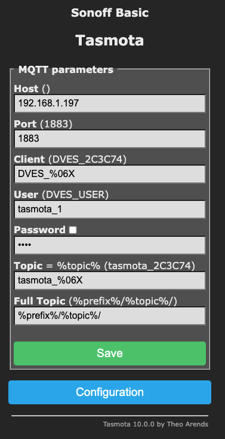
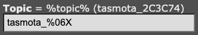
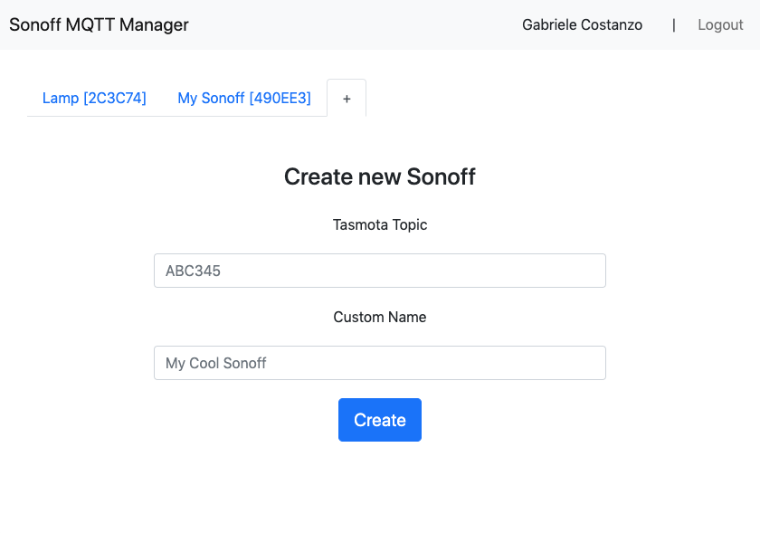

# Sonoff MQTT Manager
<i>( English | <a href="/LEGGIMI.md">Italiano</a> )</i>
<br/><br/>

This project is the result of a final assignment for the 2020/21 class of **Internet of Things Based Smart Systems** at **Unict - University of Catania**.

The main objective of this assignment is that of demonstrating the student's comprehension of a specific course topic, namely the MQTT protocol.

---

## Summary

This app provides a full-stack environment for the management of **Sonoff Wi-Fi Switches**, assuming they've already been configured using the **Tasmota** firmware and setup to connect with the MQTT broker on the local network.

The **backend** provides an authentication JWT-based system for users, which can add or remove a Sonoff to their collection simply knowing their respective Tasmota IDs.

There are API routes for toggling on & off a Sonoff, adding or deleting them from a user's list, and getting the whole list of owned Sonoffs.

Each time a Sonoff is toggled, the backend listens to its MQTT topic and creates a new Observation in the database, in order to properly update the state of the frontend view.

The **frontend** has forms for registering a new user and signing in at first launch, with sessions during (by default) maximum 1 hour and then asking again for a sign-in.

Once a user is logged in, they can navigate through tabs of their owned Sonoffs, or add a new one.

For each selected Sonoff, the user can toggle it via a ON/OFF button, delete it from their collection, and choose a timespan of observations to consider (last 1 hour, last 24 hour, last 7 days).

For a given timespan, a **Chart.js** graph is rendered of each ON/OFF event, and the whole period of "ON state" is computed, allowing the user to compute the esteemed energy consumption once an average power consumption is provided.

---

## Reproducing my environment and starting the project

This repo has been tested with a local installation of the **Eclipse Mosquitto** MQTT broker, and a local installation of **MongoDB**, both on the same machine that has the two Node.js apps running.

Once both apps have been installed, the following steps were also taken in order to get everything in working order.

1. ### Configuring a **password list**, an **access list**, and other parameters for Mosquitto.

    Namely, a `node_server` user with `password` as its password, for authenticating the backend app, and a `tasmota` user for authenticating the Sonoffs.

    The default `mosquitto_passwd` was used to generate the password list file.
    ```
    # To create the file
    mosquitto_passwd -c <password file> <username>

    # To add users to the file
    mosquitto_passwd <password file> <username>

    # Both instructions ask via prompt for the password to be associated with <username>
    ```

    The access list may be needed in order to ensure that the `node_server` is correctly subscribed to topics and correctly publishing to others.

    A simple configuration to let everyone access any topic in read & write (unsafe!) would be:
    ```
    topic readwrite $SYS/#

    pattern readwrite $SYS/#
    ```

    Finally, a `.conf` file is needed to communicate this changes to Mosquitto, either by modifying its default config file or by specifying a new file when executing it:
    ```
    mosquitto -c ./mosquitto.conf
    ```

    The parameters changed in my environment include:

    ### Defining the password file
    ```
    password_file ./password_file
    ```

    ### Allowing anonymous access (unsafe, optional)
    ```
    allow_anonymous true
    ```

    ### Defining the access list
    ```
    acl_file ./acl_file.acl
    ```

    ### Allowing access on the local network and setting port
    ```
    listener 1883 0.0.0.0
    ```

2. ### Configuring Tasmota to use MQTT correctly.

    Each Sonoff must be configured on the web-app panel accessible using the device's local IP, and the following must be ensured:
    ```
    Host: <the local IP of the computer running Mosquitto>
    Port: 1883
    Client: any
    User: <a valid user in the Mosquitto password file>
    Password: <password>
    Topic: tasmota_%06X
    Full Topic: %prefix%/%topic%/
    ```

    

    In particular:
    - the `topic` and `full topic` fields must be exactly that, because the backend expects that formatting when adding new Sonoffs
    - the IP can be the router's local IP if the 1883 port is forwarded correctly
    ```
    192.168.1.1:1883 <-----> 192.168.1.x:1883
    ```

3. ### Creating a MongoDB database for the backend

4. ### Configuring the app's `.env`, for example:

    ```
    # MQTT
    HOST=localhost
    PORT=1883
    CLIENT_ID=node_server
    USERNAME=node_server
    PASSWORD=password

    # MONGODB
    DB_HOST=127.0.0.1
    DB_NAME=SonoffDB

    # EXPRESS
    SERVER_HOST=localhost
    SERVER_PORT=3000
    JWT_SECRET=secret
    ```
5. ### Starting both Mosquitto and MongoDB, and then starting the two Node.js apps:

    Backend:

    ```
    cd server
    npm install
    npm run dev
    ```

    Frontend

    ```
    cd client
    npm install
    npm run dev
    ```

---

## How to use

The backend is an Express.js app supposed to open on `localhost:3000` by default, and the frontend a Svelte app supposed to open on `localhost:3001` by default.

Connecting to `localhost:3001` for the first time should prompt a redirect to the **Login** page, from where the **Register** page is also reachable.

### Login


### Register


Once a new user is created and a sign in is performed, the `Local Storage` will be filled with `JWT`, its expire date, and other parameters, in order to mantain a state of the user session client-side, and the user will be redirected to the **Dashboard** page.

### Dashboard


Here are the actions the user can perform from this page:

1. ### Choose a tab for an existing Sonoff in the collection

    These tabs represent the Sonoffs owned by the user.
    
    Each tab's name is comprised of the name the user associated to the device, and the device's own Tasmota ID (the `%06X` placeholder in the `tasmota_%06X` topic configured via the Tasmota web app).

    

    In this example, a working `Topic` in the sense of this web app (HTTP + MongoDB) would be the final part, `2C3C74`. It will be the backend's duty to include this app-side topic to the corresponding MQTT-side actual topics.

    Namely, `stat/tasmota_2C3C74/POWER` is the topic to subscribe to to be notified of each ON/OFF event published by Tasmota, while `cmnd/tasmota_2C3C74/Power` is the topic to publish to in order to trigger the hardware toggle on the Sonoff.

    Given a clicked and active tab, the other GUI elements will be mapped and synced accordingly to that Sonoff's Observations registered in the database, for example the energy consumption and elapsed time, the ON/OFF state and the graph.

2. ### Add a new Sonoff to the user's collection

    Clicking on this tab instead shows a form where a new Sonoff can be added, given its Tasmota topic and a user-given name.

    

    If no Sonoff is registered with that topic, the database creates a new one; otherwise, the authenticated user is added to the list of owners of that Sonoff, with the assigned name.

    The Sonoff is added as a new tab. No check on the actual existence of the device is implemented: this is in order to mantain the app's operability even when actual Sonoffs are turned off, or connect to MQTT in a later moment, while the project is already running.

3. ### Choose a timespan

    Three timespans have been implemented: last hour, last 24 hours, and last 7 days.
    Choosing a different timespan updates points 4, 5, and 6 accordingly.

4. ### The graph of events

    `Chart.js` is used in order to render a graph of each ON and OFF event registered for the active Sonoff.

    The logic in the backend is that of registering as a new Observation any published MQTT message that changes the last registered state, and deleting Observations older than 7 days.

    This approach improves on naive ones, such as registering the state on a timed basis every X seconds, in that it doesn't saturate the database with useless data that would later be removed in order to compute the graph's points to plot.

    Hovering the mouse over the graph exposes the single points, where a popup with the details about the ON/OFF state and the exact date and time is shown.

5. ### The elapsed ON time

    The label of the graph is used to show the amount of time elapsed in the ON state, during the chosen timespan.

6. ### Power consumption calculator

    This simple calculator expects the user to input the device's power on the left, in `kW`, and multiplies the value for the `elapsed ON time` to give in output the device's energy consumption in `kWh` on the right.
    
    A simple update could implement the device's power as a field in the database, still it's better to leave the option of choosing a custom value on the fly to the user, as different devices support different operational modes, which in turn correspond to different power amounts.

7. ### The ON/OFF Power button

    This button indicates the device's current state with a slight blue tint around it, in case the device is ON, and no tint around the grey button, if the device is OFF.

    Clicking on this button sends a TOGGLE command to the backend API, which in turn publishes a TOGGLE command via MQTT.

    The state of this button is synced thanks to a subscribe mechanism at each MQTT new message on the topic, and as such it automatically updates when the device is toggled via other means (physical button, manual publish on the topic, click on the Tasmota web app, ...).

8. ### Delete the Sonoff

    This button deletes the Sonoff from the user's collection. It will be actually deleted from the database if no other owner is associated to it anymore, and otherwise only the current user will be removed from its owners' list.

    The Observations are never removed (except the ones older than 7 days), so in case of an accidental deletion the state of previous observations is preserved once the Sonoff is added again to the database.

9. ### Current user and Logout

    Where previously the `Login` and `Register` links were found, now the current user's nickname is listed, together with a link to `Logout`. Login and Register pages are not available unless the user logs out, and in that case the Local Storage is emptied.

    An automatic logout is performed once the JWT expires (default: in 1 hour).